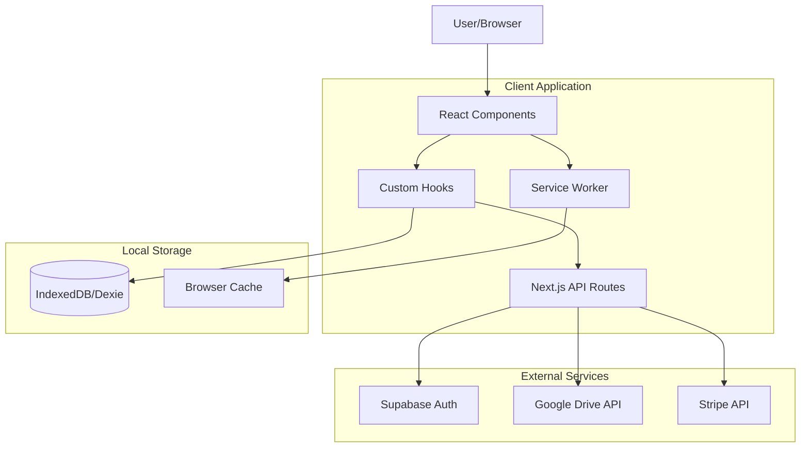
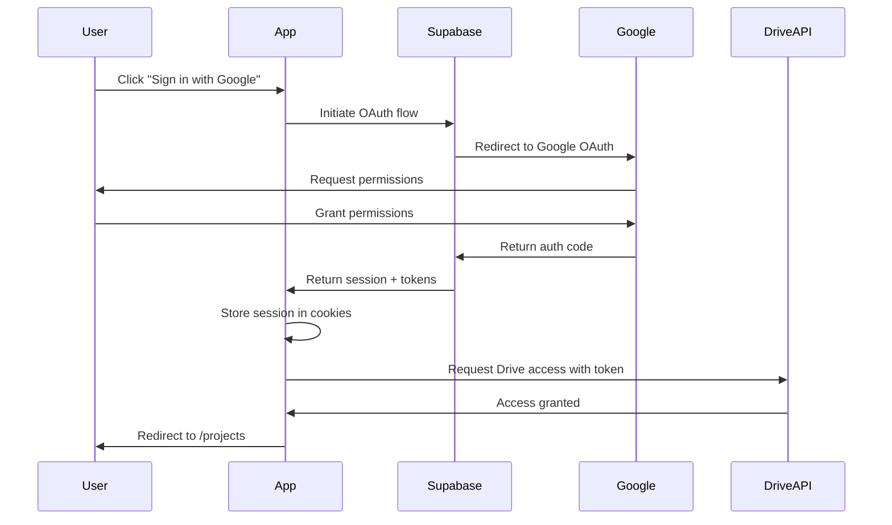
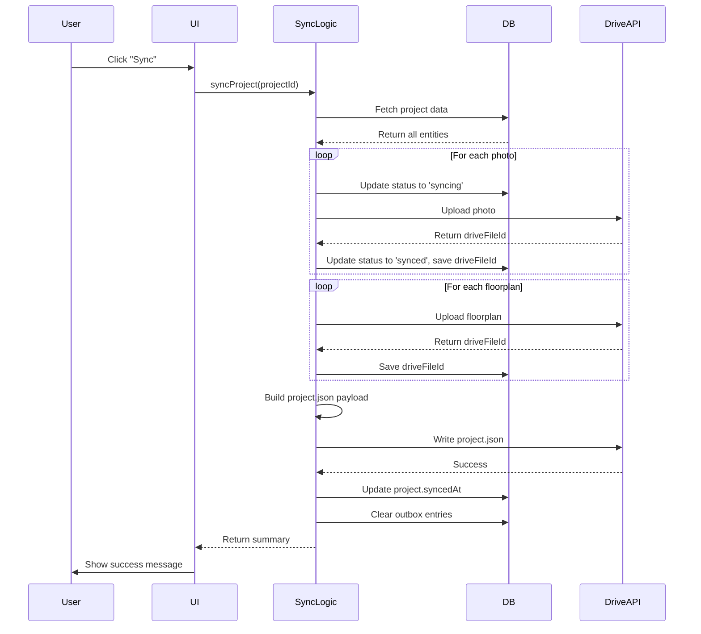
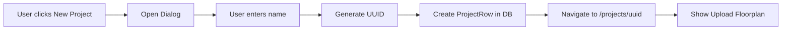
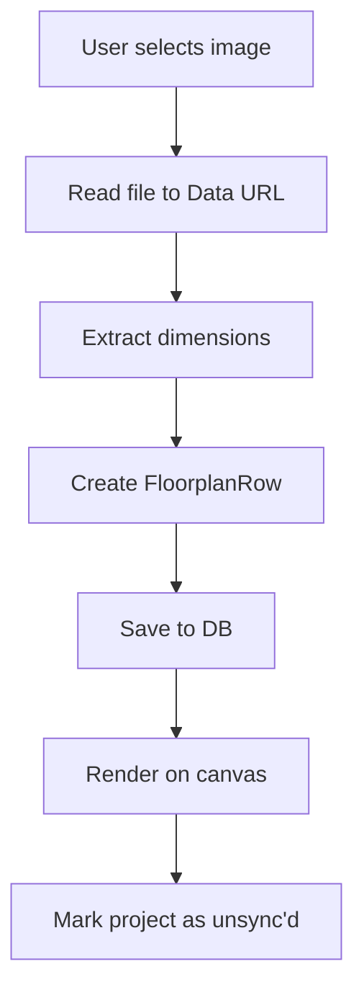
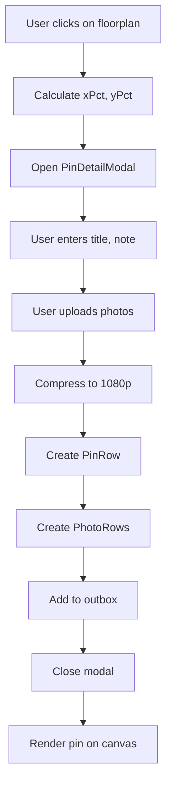
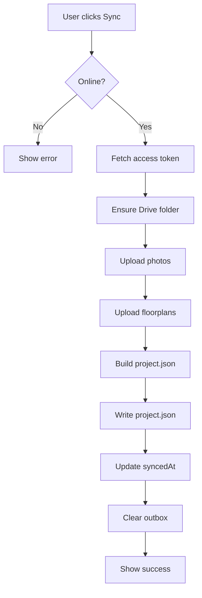
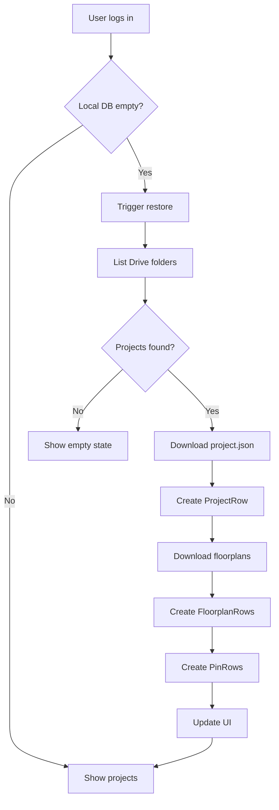

# FieldPins Architecture Documentation

## Table of Contents

1. [System Overview](#system-overview)
2. [Technology Stack](#technology-stack)
3. [High-Level Architecture](#high-level-architecture)
4. [Data Layer](#data-layer)
5. [Authentication & Authorization](#authentication--authorization)
6. [Sync Architecture](#sync-architecture)
7. [API Structure](#api-structure)
8. [Component Architecture](#component-architecture)
9. [Project Structure](#project-structure)
10. [Key Design Decisions](#key-design-decisions)
11. [Data Flow Diagrams](#data-flow-diagrams)

---

## System Overview

**FieldPins** is a mobile-first Progressive Web Application (PWA) designed for network engineers and site surveyors to capture, organize, and sync site survey data. The application follows an **offline-first architecture** with manual synchronization to Google Drive.

### Core Principles

- **Offline-First**: All data is captured and stored locally using IndexedDB; internet connectivity is only required for initial authentication and manual sync operations.
- **No Backend Database**: The application uses Google Drive as the sole cloud storage mechanism, eliminating the need for server-side databases.
- **User-Owned Data**: All project data resides in the user's Google Drive under `/My Drive/FieldPins/`.
- **Manual Sync**: Users explicitly trigger synchronization to prevent data loss and maintain control over uploads.

---

## Technology Stack

### Frontend

| Technology | Purpose | Version |
|------------|---------|---------|
| **Next.js** | React framework with SSR/SSG capabilities | 16.0.1 |
| **React** | UI library | 19.2.0 |
| **TypeScript** | Type-safe development | 5.x |
| **Tailwind CSS** | Utility-first styling | 4.1.15 |
| **Radix UI** | Accessible component primitives | Various |

### Data & Storage

| Technology | Purpose |
|------------|---------|
| **Dexie.js** | IndexedDB wrapper for local data storage |
| **IndexedDB** | Browser-native offline database |

### Authentication & Cloud

| Technology | Purpose |
|------------|---------|
| **Supabase Auth** | Authentication provider (Google OAuth) |
| **Google Drive API** | Cloud storage and file management |
| **Google OAuth 2.0** | User authentication and authorization |

### Payment & Feature Gating

| Technology | Purpose |
|------------|---------|
| **Stripe** | Subscription management and feature gating |
| **Stripe Webhooks** | Real-time subscription status updates |

### Testing

| Technology | Purpose |
|------------|---------|
| **Vitest** | Unit and integration testing |
| **Testing Library** | Component testing utilities |
| **Happy DOM** | DOM simulation for tests |

---

## High-Level Architecture



### Architectural Layers

1. **Presentation Layer** (`components/`, `app/`)
   - React components using Radix UI primitives
   - Next.js pages with file-based routing
   - Responsive, mobile-first design

2. **Business Logic Layer** (`lib/`, `hooks/`)
   - Custom React hooks for state management
   - Helper functions and utilities
   - Data transformation and mapping

3. **Data Access Layer** (`lib/db.ts`, `lib/google.ts`)
   - Dexie database schemas and operations
   - Google Drive API client wrappers
   - Sync orchestration logic

4. **API Layer** (`app/api/`)
   - Next.js API routes for server-side operations
   - Authentication callbacks
   - Stripe webhook handlers
   - Google Drive proxies for secure token usage

5. **External Integration Layer**
   - Supabase for authentication
   - Google Drive for cloud storage
   - Stripe for payment processing

---

## Data Layer

### Local Database Schema (Dexie/IndexedDB)

The application uses a single IndexedDB database named `FieldPins_db` with the following tables:

#### Projects

Represents a site survey project.

```typescript
interface ProjectRow {
  id: string                    // UUID
  name: string                  // User-defined project name
  createdAt: string            // ISO timestamp
  updatedAt: string            // ISO timestamp
  driveFolderId?: string       // Google Drive folder ID
  syncedAt?: string            // Last successful sync timestamp
  syncAnomaly?: 'moved' | 'missing' | null  // Sync issue flag
}
```

**Indexes**: `id` (primary), `name`, `updatedAt`, `syncedAt`

#### Floorplans

Represents a floorplan image within a project.

```typescript
interface FloorplanRow {
  id: string                    // UUID
  projectId: string            // Foreign key to ProjectRow
  name: string                 // Filename or user label
  type: string                 // MIME type (e.g., 'image/jpeg')
  width: number                // Image width in pixels
  height: number               // Image height in pixels
  localUri: string             // Data URL or blob URL
  driveFileId?: string         // Google Drive file ID
}
```

**Indexes**: `id` (primary), `projectId`

#### Pins

Represents a pin placed on a floorplan.

```typescript
interface PinRow {
  id: string                    // UUID
  floorplanId: string          // Foreign key to FloorplanRow
  title: string                // Pin title
  note: string                 // Pin description/notes
  xPct: number                 // X position as % of image width (0-1)
  yPct: number                 // Y position as % of image height (0-1)
  updatedAt: string            // ISO timestamp
}
```

**Indexes**: `id` (primary), `floorplanId`, `updatedAt`

#### Photos

Represents a photo attached to a pin (max 4 per pin).

```typescript
interface PhotoRow {
  id: string                    // UUID
  pinId: string                // Foreign key to PinRow
  localUri: string             // Data URL or blob URL
  width: number                // Photo width in pixels
  height: number               // Photo height in pixels
  sizeBytes: number            // File size
  driveFileId?: string         // Google Drive file ID
  status: SyncStatus           // 'synced' | 'pending' | 'error' | 'syncing'
}
```

**Indexes**: `id` (primary), `pinId`, `status`

**Constraints**: Maximum 4 photos per pin, compressed to 1080p JPEG.

#### Outbox

Tracks pending sync operations for retry logic.

```typescript
interface OutboxRow {
  id: string                              // UUID
  kind: string                            // Operation type (e.g., 'upload_photo')
  entityType: 'project' | 'floorplan' | 'pin' | 'photo'
  entityId: string                        // ID of the entity to sync
  payload: any                            // Operation-specific data
  retries: number                         // Attempt count
  lastTriedAt?: string                    // ISO timestamp of last attempt
}
```

**Indexes**: `id` (primary), `entityType`, `entityId`, `kind`

### Cloud Storage Schema (Google Drive)

Projects are stored in Google Drive under the following structure:

```
/My Drive/
  └── FieldPins/
      └── <ProjectName>__<projectId>/
          ├── project.json              # Master project manifest
          ├── floorplans/
          │   └── <floorplanId>.jpg    # Floorplan images
          └── pins/
              └── <pinId>/
                  ├── <photoId>.jpg    # Pin photos (max 4)
                  ├── <photoId>.jpg
                  └── ...
```

#### project.json Schema

```json
{
  "schemaVersion": "1.0",
  "appVersion": "MVP",
  "project": {
    "id": "uuid",
    "name": "Project Name",
    "createdAt": "2025-11-27T10:00:00.000Z",
    "updatedAt": "2025-11-27T12:30:00.000Z",
    "syncedAt": "2025-11-27T12:30:00.000Z",
    "activeFloorplanId": "uuid"
  },
  "floorplans": [
    {
      "id": "uuid",
      "name": "Building A - Floor 1",
      "type": "image/jpeg",
      "width": 2048,
      "height": 1536,
      "driveFileId": "1abc...xyz"
    }
  ],
  "pins": [
    {
      "id": "uuid",
      "floorplanId": "uuid",
      "title": "Access Point #1",
      "note": "Ceiling mount, requires PoE",
      "xPct": 0.35,
      "yPct": 0.42,
      "updatedAt": "2025-11-27T11:15:00.000Z",
      "photos": [
        {
          "id": "uuid",
          "driveFileId": "2def...abc",
          "width": 1920,
          "height": 1080,
          "sizeBytes": 245632
        }
      ]
    }
  ]
}
```

---

## Authentication & Authorization

### Authentication Flow

FieldPins uses **Supabase Auth** with Google OAuth as the authentication provider.



### OAuth Scopes

The application requests the following Google OAuth scopes:

- `openid` - User identity verification
- `email` - User email address
- `profile` - Basic user profile information
- `https://www.googleapis.com/auth/drive` - Full Google Drive access

### Session Management

- **Server-side**: Sessions are managed using Supabase SSR with HTTP-only cookies
- **Client-side**: Session state is accessed via `useAuth` hook and Supabase context
- **Middleware**: Next.js middleware (`middleware.ts`) validates sessions on protected routes

### User Profiles (Supabase)

The application maintains a `profiles` table in Supabase for:

- **Subscription Status**: Tracks Stripe subscription tier (`free`, `pro`, etc.)
- **User Metadata**: Stores user preferences and settings

```sql
profiles {
  id: uuid (FK to auth.users)
  subscription_status: text
  created_at: timestamp
  updated_at: timestamp
}
```

### Feature Gating

Subscription-based features are enforced client-side and server-side:

- **Free Tier**: 1 project, 1 floorplan per project
- **Pro Tier**: Unlimited projects and floorplans

The `useAuth` hook provides `subscriptionStatus` which components use to conditionally render features or show upgrade prompts.

---

## Sync Architecture

### Sync Strategy

FieldPins implements a **manual, optimistic sync** strategy:

1. All data is captured and modified locally first
2. Users manually trigger sync via a "Sync" button
3. Local changes are uploaded to Google Drive
4. The `project.json` manifest is written last (acts as commit point)
5. Successful uploads mark entities as "synced" in local DB

### Sync Flow



### Conflict Resolution

- **Policy**: Last-write-wins (by `updatedAt` timestamp)
- **No Automatic Merge**: Manual sync prevents concurrent edits
- **Single Author**: MVP design assumes single-user per project

### Retry Logic

Failed sync operations are tracked in the `outbox` table:

- **Exponential Backoff**: 2s base delay, doubles per retry
- **Max Retries**: 3 attempts per operation
- **Fatal Errors**: 401/403 authentication errors abort retry
- **Photo Deletion**: Deleted photos are tracked in outbox for Drive cleanup

### Sync Status Indicators

- **Photos**: `pending`, `syncing`, `synced`, `error`
- **Projects**: `syncedAt` timestamp indicates last successful sync
- **Anomalies**: `syncAnomaly` field flags moved/missing Drive folders

---

## API Structure

### Next.js API Routes

All server-side logic is implemented as Next.js API routes under `app/api/`.

#### Authentication Routes

**`/api/auth/callback/route.ts`**
- Handles Supabase OAuth callback
- Stores session in cookies
- Redirects to `/projects`

#### Stripe Routes

**`/api/checkout/route.ts`**
- Creates Stripe Checkout session
- Returns session URL for redirect

**`/api/billing-portal/route.ts`**
- Creates Stripe Customer Portal session
- Allows users to manage subscriptions

**`/api/webhooks/route.ts`**
- Handles Stripe webhook events
- Updates `subscription_status` in Supabase on subscription changes

#### Google Drive Routes

All Drive operations are proxied through API routes to keep tokens server-side.

**`/api/drive/ensure/route.ts`**
- Ensures FieldPins folder exists in Drive
- Returns folder ID

**`/api/drive/list-projects/route.ts`**
- Lists all project folders under FieldPins
- Returns folder names and IDs

**`/api/drive/upload/floorplan/route.ts`**
- Uploads floorplan image to Drive
- Returns `driveFileId`

**`/api/drive/upload/photo/route.ts`**
- Uploads photo to Drive under `/pins/<pinId>/`
- Returns `driveFileId`

**`/api/drive/write/route.ts`**
- Writes or updates `project.json` in Drive

**`/api/drive/download/project-json/route.ts`**
- Downloads `project.json` from Drive
- Used during project restore

**`/api/drive/download/file/route.ts`**
- Downloads any file by ID from Drive
- Returns data URL

**`/api/drive/delete/[fileId]/route.ts`**
- Deletes a file from Drive (used for photo cleanup)

**`/api/drive/relink/route.ts`**
- Relinks a local project to a different Drive folder
- Handles folder moves/renames

---

## Component Architecture

### Component Organization

Components are organized by function:

```
components/
├── ui/                          # Reusable UI primitives (Radix wrappers)
│   ├── button.tsx
│   ├── dialog.tsx
│   ├── input.tsx
│   └── ...
├── landing/                     # Landing page components
│   ├── Hero.tsx
│   ├── Features.tsx
│   ├── FAQ.tsx
│   └── ...
├── auth-gate.tsx               # Route protection wrapper
├── nav-bar.tsx                 # App navigation
├── project-card.tsx            # Project list item
├── project-create-dialog.tsx   # New project modal
├── floorplan-switcher.tsx      # Floorplan selector
├── pin-marker.tsx              # Pin visualization on canvas
├── pin-detail-modal.tsx        # Pin edit/view dialog
├── pin-photo-gallery.tsx       # Photo viewer with upload
├── sync-banner.tsx             # Sync status indicator
├── sync-issues-dialog.tsx      # Sync error details
├── pricing-modal.tsx           # Subscription upgrade prompt
├── restore-progress-overlay.tsx # Drive restore progress
├── relink-dialog.tsx           # Folder relink UI
└── supabase-provider.tsx       # Auth context provider
```

### Key Components

#### `<SupabaseProvider>`

**Purpose**: Provides Supabase client and auth context to the entire app.

**Props**:
- `initialSession`: Server-fetched session for SSR hydration
- `initialSubscriptionStatus`: User's subscription tier

**Context Exposed**:
- `supabase`: Supabase client instance
- `session`: Current user session
- `subscriptionStatus`: `'free'` or `'pro'`

#### `<AuthGate>`

**Purpose**: Protects routes requiring authentication.

**Behavior**:
- Redirects unauthenticated users to landing page
- Shows loading state during session check

#### `<PinDetailModal>`

**Purpose**: Edit or create pins with title, note, and photos.

**Features**:
- Form validation
- Photo upload (max 4, compression to 1080p)
- Real-time preview
- Auto-save on close

#### `<PinPhotoGallery>`

**Purpose**: Display and manage photos for a pin.

**Features**:
- Thumbnail grid view
- Lightbox for full-size view
- Delete photos
- Upload new photos
- Sync status indicators per photo

#### `<SyncBanner>`

**Purpose**: Display sync status and trigger manual sync.

**States**:
- Idle: Shows last sync time
- Syncing: Progress indicator
- Error: Shows error count with details link

#### `<RestoreProgressOverlay>`

**Purpose**: Display progress during Drive project restore.

**Phases**:
- Discovering: Finding projects in Drive
- Downloading: Fetching project data
- Complete: Summary of restored projects

---

## Project Structure

```
site-survey-tool/
├── app/                        # Next.js app router
│   ├── api/                   # API routes
│   ├── auth/                  # Auth callback pages
│   ├── projects/              # Projects pages
│   │   ├── page.tsx          # Project list
│   │   └── [projectId]/      # Project detail
│   ├── settings/              # User settings
│   ├── layout.tsx             # Root layout
│   ├── page.tsx               # Landing page
│   ├── providers.tsx          # Client-side providers
│   └── globals.css            # Global styles
├── components/                # React components
├── lib/                       # Core business logic
│   ├── db.ts                 # Dexie schema
│   ├── google.ts             # Drive client functions
│   ├── google-server.ts      # Server-side Drive utilities
│   ├── sync.ts               # Sync orchestration
│   ├── restore.ts            # Project restore from Drive
│   ├── mappers.ts            # Data transformations
│   ├── useAuth.ts            # Auth hook
│   ├── useOnline.ts          # Network status hook
│   ├── supabase/             # Supabase clients
│   │   ├── client.ts         # Browser client
│   │   └── server.ts         # Server client
│   └── utils.ts              # Utilities
├── core/                      # Core types and schemas
│   ├── models.ts             # Domain models
│   ├── schemas.ts            # Zod validation schemas
│   └── mappers.ts            # Model↔Row transformations
├── hooks/                     # Custom React hooks
├── docs/                      # Documentation
├── tests/                     # Test files
├── public/                    # Static assets
├── middleware.ts              # Next.js middleware
├── package.json
├── tsconfig.json
└── next.config.mjs
```

---

## Key Design Decisions

### 1. Offline-First Architecture

**Rationale**: Site surveys often occur in areas with poor connectivity (basements, remote sites, industrial facilities).

**Trade-offs**:
- ✅ Users can work without interruption
- ✅ No data loss during network outages
- ❌ Requires manual sync step
- ❌ Potential for stale local data

### 2. Google Drive as Database

**Rationale**: Eliminates server infrastructure costs; users own their data; aligns with user trust and privacy expectations.

**Trade-offs**:
- ✅ Zero backend hosting costs
- ✅ User data sovereignty
- ✅ Built-in Drive features (versioning, sharing)
- ❌ Limited query capabilities
- ❌ Collaboration complexity
- ❌ API rate limits

### 3. Manual Sync Only

**Rationale**: Prevents accidental data loss, gives users control over when network is used, and simplifies conflict resolution.

**Trade-offs**:
- ✅ Predictable behavior
- ✅ No surprise data charges
- ✅ Simple conflict model
- ❌ Users must remember to sync
- ❌ Risk of losing unsync'd data

### 4. No Backend Database (Supabase-less Data)

**Rationale**: Originally planned to use Supabase for metadata, but removed to simplify MVP and reduce dependencies.

**Current Use of Supabase**:
- Authentication only
- User profiles for subscription status

**Trade-offs**:
- ✅ Simpler architecture
- ✅ Lower operational costs
- ❌ Slower queries (must fetch from Drive)
- ❌ Limited analytics capabilities

### 5. Supabase Auth + Google OAuth

**Rationale**: Leverage Supabase's robust auth infrastructure while maintaining Google integration for Drive access.

**Trade-offs**:
- ✅ Secure, production-ready auth
- ✅ Easy session management
- ✅ Built-in token refresh
- ❌ Tight coupling to Supabase
- ❌ Multiple auth tokens (Supabase + Google)

### 6. 4-Photo-Per-Pin Limit

**Rationale**: Balances documentation needs with storage efficiency and UI complexity.

**Trade-offs**:
- ✅ Prevents bloat
- ✅ Faster uploads
- ✅ Cleaner UI
- ❌ May be restrictive for some use cases

### 7. 1080p Photo Compression

**Rationale**: Reduces storage and bandwidth usage while maintaining sufficient detail for field documentation.

**Trade-offs**:
- ✅ 80-90% file size reduction
- ✅ Faster uploads
- ✅ Sufficient quality for documentation
- ❌ Loss of original resolution

### 8. Percentage-Based Pin Coordinates

**Rationale**: Allows pins to scale correctly regardless of display size or zoom level.

**Trade-offs**:
- ✅ Resolution-independent
- ✅ Works across devices
- ✅ Simple math
- ❌ Requires recalculation on resize

### 9. Last-Write-Wins Conflict Resolution

**Rationale**: Simple, predictable model suitable for single-user projects.

**Trade-offs**:
- ✅ Easy to understand
- ✅ No complex merge logic
- ❌ Data loss if multiple edits occur offline

---

## Data Flow Diagrams

### Project Creation Flow



### Floorplan Upload Flow



### Pin Creation Flow



### Manual Sync Flow



### Project Restore Flow



---

## Logging and Observability

### Logging Strategy

FieldPins uses a **centralized logging utility** (`lib/logger.ts`) to ensure consistent, secure, and environment-aware logging throughout the application.

#### Logging Utility Overview

The logger provides multiple log levels with automatic environment detection:

```typescript
import { logger } from '@/lib/logger';

// Development-only logs (silent in production)
logger.debug('Detailed debugging info', { userId: '123' });
logger.info('General information');

// All-environment logs (always visible)
logger.warn('Potential issue detected', { details: '...' });
logger.error('Error occurred', error);

// Domain-specific helpers (development-only)
logger.sync('Photo uploaded', projectId, { photoId: '123' });
logger.auth('User signed in', { userId: user.id });
logger.drive('Folder created', { folderId: 'abc' });
logger.restore('Project restored', { projectName: 'Building A' });
```

#### Log Levels

| Level | When to Use | Visibility |
|-------|-------------|------------|
| `debug()` | Detailed debugging during development | Dev only |
| `info()` | General informational messages | Dev only |
| `warn()` | Potentially harmful situations | All environments |
| `error()` | Error conditions requiring attention | All environments |

#### Domain-Specific Helpers

For consistency, use these specialized loggers for common domains:

- **`logger.sync()`** - Sync operations with Google Drive
- **`logger.auth()`** - Authentication flows
- **`logger.drive()`** - Google Drive API interactions
- **`logger.restore()`** - Project restore operations

#### Best Practices

**✅ Do:**
```typescript
// Use descriptive messages with context
logger.debug('User created new project', { projectId, projectName });

// Log errors with the error object
logger.error('Failed to upload photo', error, { photoId, pinId });

// Use domain helpers for related operations
logger.sync('Starting project sync', projectId, { photoCount: 5 });
```

**❌ Don't:**
```typescript
// Never use console.log directly (bypasses environment checks)
console.log('User clicked button'); // ❌

// Don't log sensitive data (even in dev mode)
logger.debug('User data', { password: '...' }); // ❌

// Avoid generic messages without context
logger.info('Success'); // ❌ Too vague
```

### Error Monitoring

**Current State**: Basic client-side logging to browser console.

**Planned Integration** (Post-MVP):
- **Sentry** for production error tracking
- **LogRocket** for session replay and debugging
- **Structured logs** with correlation IDs for distributed tracing

### Performance Monitoring

**Current State**: Vercel Analytics enabled for basic web vitals.

**Future Enhancements**:
- Custom performance marks for sync operations
- IndexedDB query performance tracking
- Drive API latency monitoring

### Debugging Tips

**Enable verbose logging** in development:
```typescript
// All logger.debug() and logger.info() calls automatically appear in dev mode
// Filter by prefix in browser console: [DEBUG], [INFO], [sync], [auth], etc.
```

**Production debugging**:
- Warnings and errors are always logged
- Check browser console for error stack traces
- Use Vercel Analytics for page performance data

---

## Future Considerations

### Planned Features (Post-MVP)

1. **Collaboration**: Multi-user editing with Drive sharing
2. **PDF Export**: Generate formatted reports from project data
3. **Native Mobile App**: Capacitor wrapper for better camera and offline support
4. **Auto-Sync**: Background sync with conflict detection
5. **Project Templates**: Pre-defined pin categories and workflows
6. **Analytics Dashboard**: Usage metrics and project insights

### Scalability Considerations

- **Drive API Rate Limits**: Current manual sync approach stays well within limits; auto-sync would require batching and queueing
- **Large Projects**: Projects with 100+ pins and 400+ photos may experience slow sync; consider pagination or lazy loading
- **Multi-Tenant**: Current user-scoped DB approach can scale to thousands of users per browser profile

### Known Limitations

- **Single-User Projects**: No real-time collaboration support
- **Manual Sync Required**: Users must remember to sync
- **Browser Storage Limits**: IndexedDB quota varies by browser (typically 50-100GB)
- **Photo Quality**: 1080p compression may not suffice for highly detailed documentation

---

## References

- [PRD v0.3](../Site_Survey_Tool_PRD_v0.3.md)
- [Multi-User Architecture](../MULTI_USER.md)
- [README](../README.md)
- [Testing Documentation](./TESTING.md)
- [Sync Documentation](./sync.md)
- [Offline Documentation](./offline.md)

---

**Document Version**: 1.0  
**Last Updated**: 2025-11-27  
**Maintainer**: João Silva
