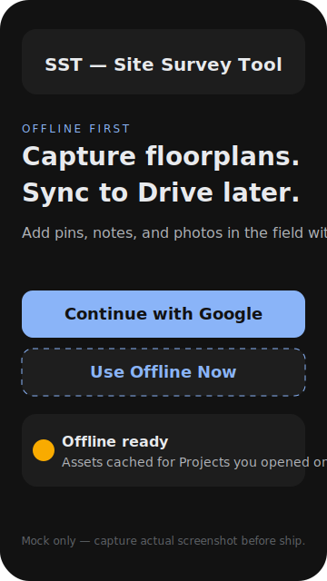

- # Onboarding

SST is a mobile-first PWA that lets crews capture floorplans, pins, notes, and photos offline, then push everything to Google Drive on demand. Use this guide to get from the new landing page to your first successful sync.

## Landing: Start Online or Offline

- Primary CTA: `Continue with Google` handles OAuth (`openid email profile https://www.googleapis.com/auth/drive`) and queues a Drive sync.
- Secondary link: `Use Offline Now` jumps straight to `Projects` with no authentication. You can capture everything offline, then return later to sync.
- Offline banner: when the device is offline, the Google CTA is disabled with a tooltip explaining why and `Use Offline Now` remains active.

> Tip: Install the PWA to your home screen (Android Chrome or iOS Safari) for a full-screen field experience.

## Device Prep

- Supported browsers: Chrome (Android), Safari (iOS), Chromium-based desktop browsers.
- Allow camera and storage permissions so photos can be resized to 1080p and cached locally via Dexie/IndexedDB.
- Optional: preload key projects while online so their floorplan imagery is cached for offline use (see [Offline](./offline.md)).

## First Run & Projects

1. Open `https://your-host/` (local development: `http://localhost:3000`).
2. Hit `Use Offline Now` if you’re in the field without connectivity; otherwise continue with Google.
3. The `Projects` grid reads from Dexie. On first launch, demo data seeds automatically.
4. Tap a project card to view floorplans, pins, and sync status.

## Capture Workflow (≤5s Goal)

### Add a Pin

1. Tap `Add Pin`.
2. Tap a location on the floorplan canvas (pins store `%` coordinates of the image).
3. Fill in title and notes; the entry autosaves locally.

### Attach Photos (4 max @ 1080p)

1. Open the pin drawer and choose `Attach photos`.
2. Select up to four images. Each is resized client-side to a max 1080px edge (JPEG ~0.75 quality).
3. Tap a thumbnail to review metadata (resolution, status). Delete to free up the slot.

## Manual Sync (When Back Online)

1. Sign in with Google if you have not already.
2. Tap `Sync Now` in the banner. Items move through Pending → Syncing → Synced or Failed.
3. If Drive reports the project folder moved, follow the relink prompt (see Projects > “Relink”) before retrying.
4. `project.json` writes last after floorplans, pins, and photos finish uploading.

## What Happens Offline

- Edits, floorplans, pins, and photos live in Dexie. Sync waits for connectivity.
- Banner stays yellow (`Pending`) until Drive uploads clear; red indicates retries/backoff (see [Offline guide](./offline.md#queueing-and-retries)).
- You can continue switching between cached floorplans and adding content even with Wi-Fi disabled.

## Next Steps

- Read the [Offline guide](./offline.md) for full offline capture tips.
- Review [Privacy](./privacy.md) to understand exactly what SST reads/writes in your Drive.
