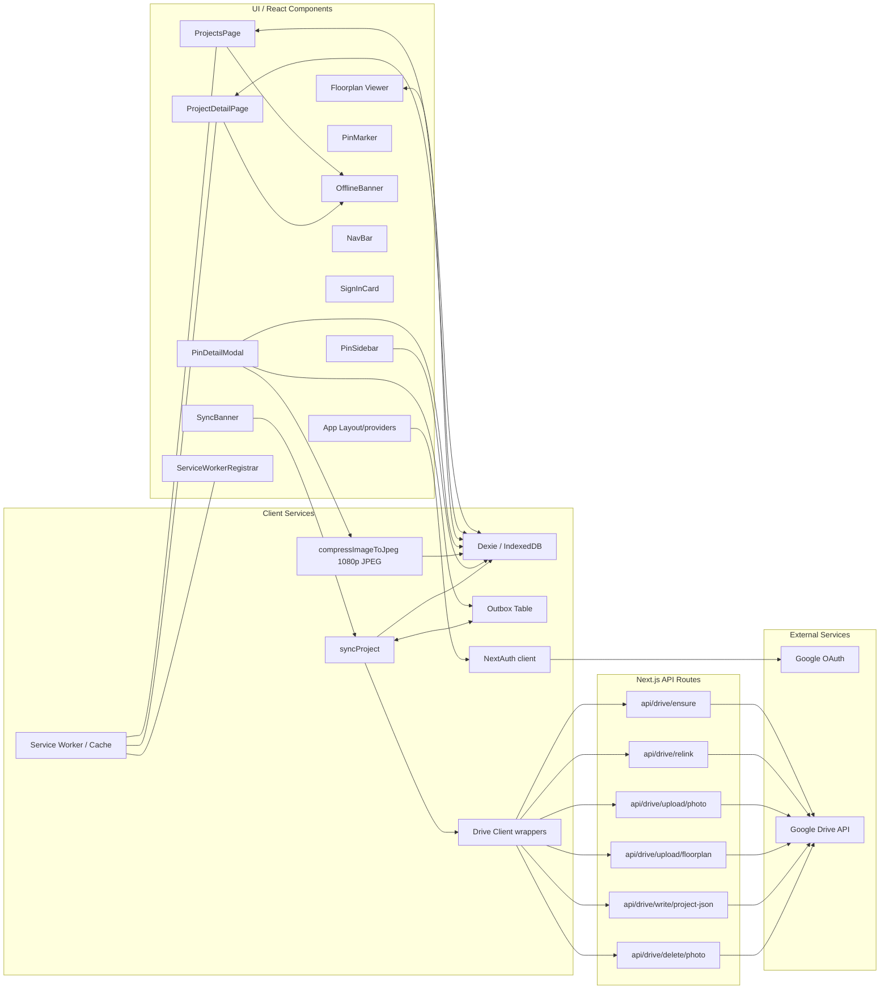
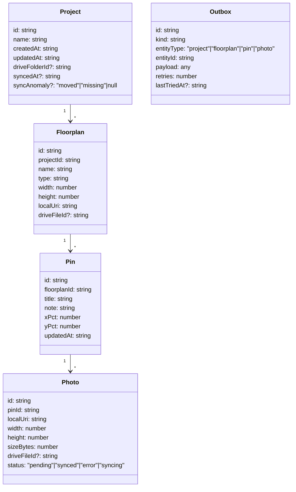
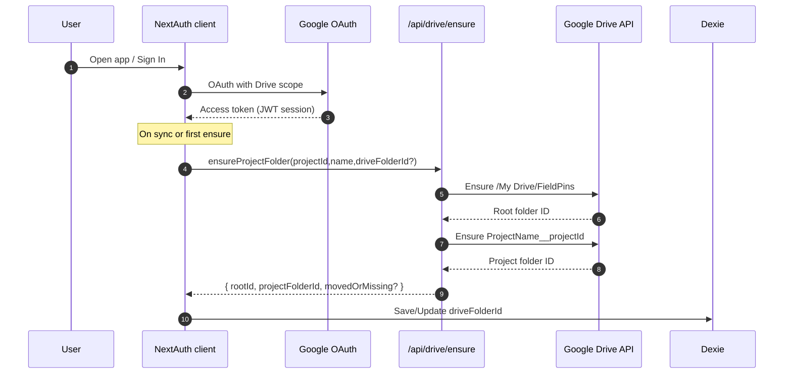
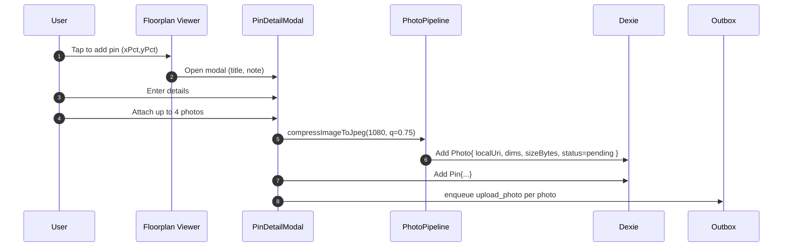
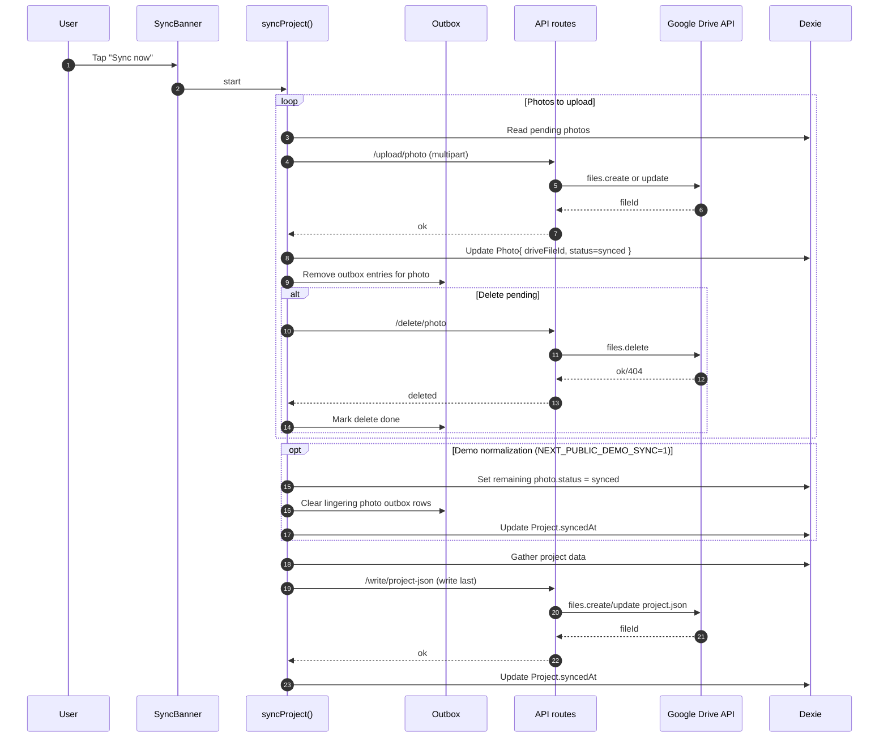
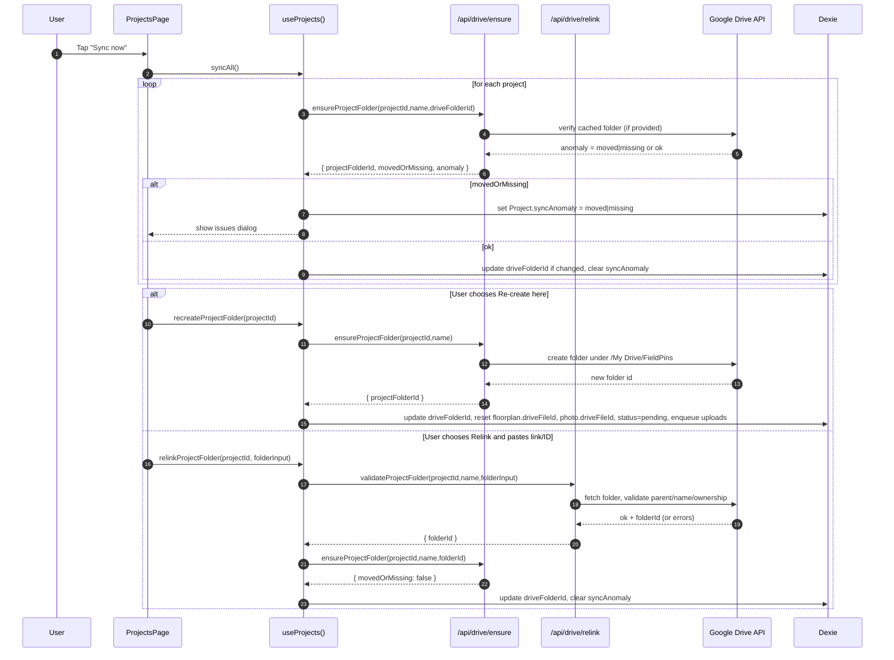
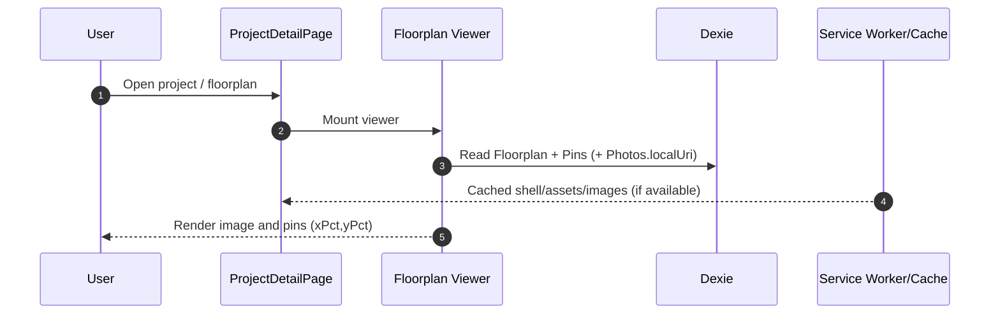

FieldPins UML — UI, React Components, and External Services

This document captures how the FieldPins Next.js PWA interacts across the UI, React components, client-side services, and external Google APIs, within the MVP constraints (manual sync, no backend DB, offline-first).

Component Interaction Diagram

Data Model Snapshot (for reference)

Sequence — Login + Drive Root Setup

Sequence — Add Pin + Photos (Offline First)

Sequence — Manual Sync (Outbox Processing)

Sequence — Moved/Renamed Drive Folder (Detect, Re-create, Relink)

Sequence — Floorplan Viewer (Load & Render)

Notes and Assumptions
- No backend database; all data is client-side with Dexie/IndexedDB.
- Manual sync only; no auto-sync. User initiates via SyncBanner.
- Google scopes: `openid email profile https://www.googleapis.com/auth/drive` via NextAuth; tokens live in session (JWT) client-accessible for API calls.
- Photo pipeline enforces max 4 photos per pin and max 1080p JPEG.
- Drive layout: `/My Drive/FieldPins/<ProjectName>__<projectId>/`; `project.json` is written last.
- Moved/renamed/missing folders surface as `syncAnomaly` and are resolved via Re-create or Relink flows.
